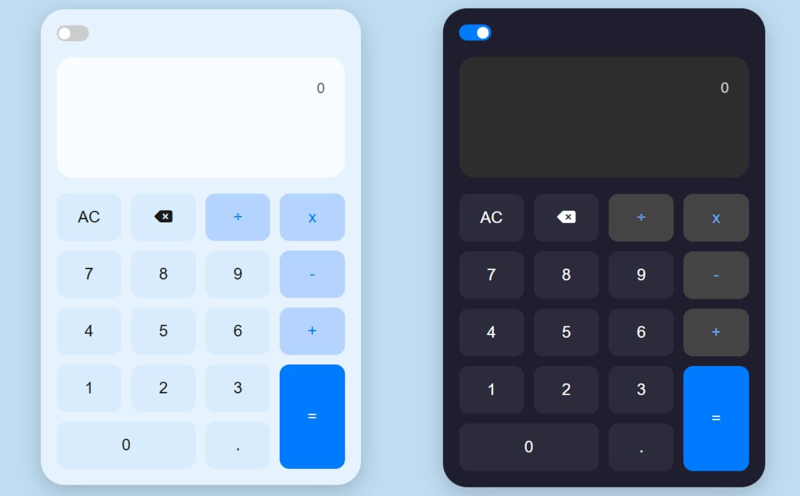

# Calculadora Simples

Uma calculadora desenvolvida com HTML, CSS e JavaScript — inclui modo escuro e realiza operações aritméticas básicas. Este projeto foi criado com o objetivo de praticar e reforçar conhecimentos em front-end.

 

## Como usar

Basta clonar o repositório e abrir o arquivo `index.html` no navegador:

```bash
git clone https://github.com/anakessia/calculator-dual-theme.git

```
## Licença
Este projeto está sob a licença MIT. Use, modifique e compartilhe à vontade!
<p>Feito por @anakessia</p>
